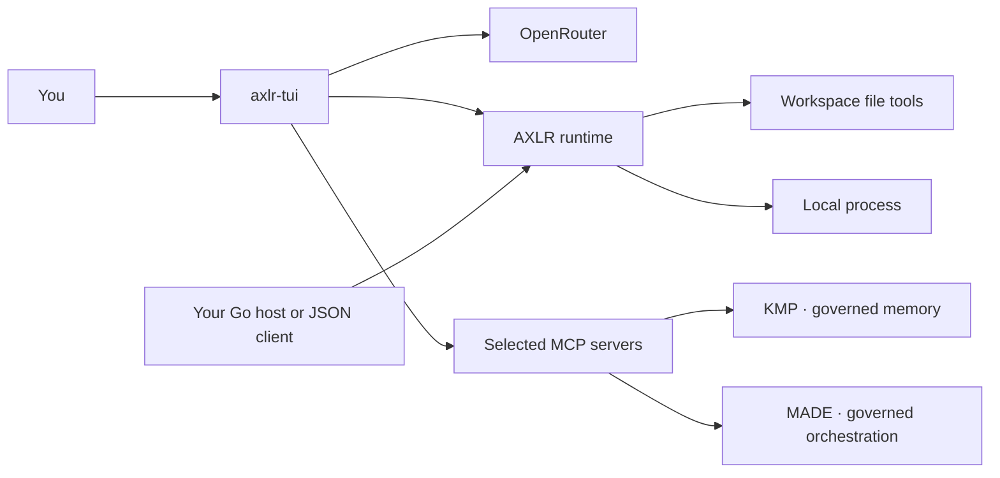

<p align="center"><picture><source media="(prefers-color-scheme: dark)" srcset="docs/assets/brand/axlr-emblem-dark.svg"></picture></p>

<p align="center"><strong>Execute with AXLR. Remember with KMP. Coordinate with MADE.</strong></p>

AXLR is Underpass's default execution engine for agentic work. It owns the model loop, tools, approvals and sessions. KMP supplies durable, evidence-backed memory; MADE supplies tracked procedures and decision records. Connect both engines through MCP, then extend AXLR with other MCP tools and compatible OpenAI/Codex plugin packages. The [product contract](docs/product.md) defines these responsibilities and the capabilities available in each interface.

AXLR operates in a **trusted workspace**. File tools stay inside the selected root; executed programs and connected MCP servers use the authority of their host. The console and JSON worker are not sandboxes. The HTTP, gRPC and MCP service adds mTLS and explicit client roles.

## Start the console

Build from a full checkout with Go 1.26:

```bash
GOWORK=off go test ./...
GOWORK=off go -C tui test ./...
GOWORK=off go -C tui build -trimpath -o /tmp/axlr-tui ./cmd/axlr-tui
/tmp/axlr-tui --root "$PWD"
```

Supply `OPENROUTER_API_KEY` through your normal environment or secret manager before launching, or configure [local models](docs/console.md#local-models) served by llama.cpp or vLLM. In the console, choose a model with `/model` and send a prompt. Use `F1` for controls, `/mcp` for AXLR's server connections, `/plugin` for AXLR-managed packages, and `/update` to update the connected local MADE and KMP engines.

The console is a separate Go module in [`tui/`](tui/README.md). It can start with `--lang es` for Spanish labels and `--model provider/model` to skip the model picker. New sessions use `/normal`; `/review`, `/writer` and `/research` tailor local tool policy, while `/debug`, `/delivery`, `/incident`, `/repair` and `/improve` run prepared MADE procedures (`axlr-tui --repair "<brief>"` lets the console repair its own repository through a pull request, and the agent can request that repair from any session with evidence the console validates; `axlr-tui --improve "<brief or #issue>"` improves it the same way, against a check that fails first, and always leaves the merge to you; the agent can request an improvement too). Follow the [agent workflow](docs/runbooks/agent-workflow.md) to put AXLR, KMP and MADE to work together.

After the second user prompt clarifies the task, the built-in session skill guides the agent to set a concise title while preserving manual titles. With KMP connected, it recovers the exact project scope and checks for relevant connections between abouts; proposed relations require supporting evidence before they are recorded.

## Choose a path

| You want to… | Read |
|:--|:--|
| Understand AXLR’s product role and current limits | [Product contract](docs/product.md) |
| Install, launch and send a first prompt | [Getting started](docs/getting-started.md) |
| Use models, controls, sessions and diagnostics | [Console guide](docs/console.md) |
| Connect KMP or MADE | [KMP runbook](docs/runbooks/kmp.md), [MADE runbook](docs/runbooks/made.md) |
| Choose a work mode, run a ceremony or hand off a task | [Console modes](docs/console.md#work-modes), [ceremonies](docs/ceremonies.md) |
| Connect an MCP server or install a package | [Plugins and MCP](docs/plugins.md) |
| Call AXLR from a process through JSON | [Worker contract](docs/worker.md) |
| Run the HTTP, gRPC or MCP service or deploy AXLR with Helm | [Service API](docs/api.md), [transport parity](docs/transport-parity.md), [Helm guide](docs/helm.md), [release process](docs/releasing.md) |
| Embed AXLR in Go or use its MCP client | [Go library](docs/library.md) |
| Understand boundaries and package ownership | [Architecture](docs/architecture.md) |
| Resolve a startup, model, plugin or session problem | [Troubleshooting](docs/troubleshooting.md) |

[Documentation home](docs/index.md) includes the current guides and the historical design record.

## What runs where



In the console, the model can request a tool; AXLR shows or enforces the relevant approval policy before calling it. AXLR uses Codex-compatible plugin manifests and standard MCP connections: a Codex plugin built around skills and MCP servers will often work in AXLR without repackaging. `/plugin` installs the package into AXLR and registers declared servers with manual approval; `/mcp` shows the actual connections. A built-in KMP or MADE catalogue entry alone does not start either engine. See the [compatibility table](docs/plugins.md#codex-plugin-compatibility) for the supported components.

The JSON worker, `cmd/axlr`, accepts exactly one request on stdin and returns one response on stdout. It exposes `read`, `write`, `edit`, `exec`, `plugins.list` and `plugins.call`. The library exposes typed use cases and an OpenRouter client for non-streaming and streaming completions. See the [worker](docs/worker.md) and [library](docs/library.md) guides for examples.

## Project status

AXLR is an evolving pre-1.0 project with two Go modules. The console runs interactive tasks; the worker exposes a one-request process API; `axlr-serve` exposes its 18 capabilities over HTTP, gRPC and MCP with mTLS. The checked-in release matrix targets Linux, macOS and Windows on amd64 and arm64. The Helm chart and release workflow are implemented; published assets require a successful tagged run. Source-build instructions use POSIX shell syntax. The service currently configures KMP and MADE only and does not expose the console's plugin installation or work-mode controls.

Part of [Underpass AI](https://underpassai.com).
