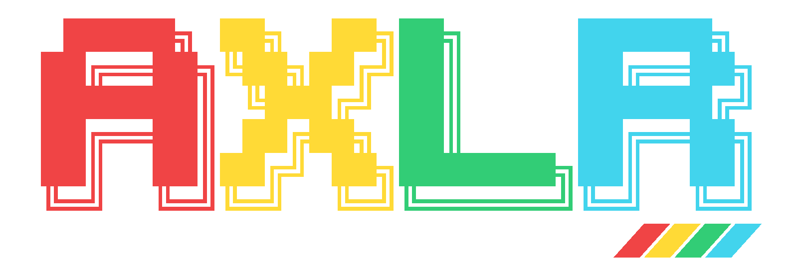
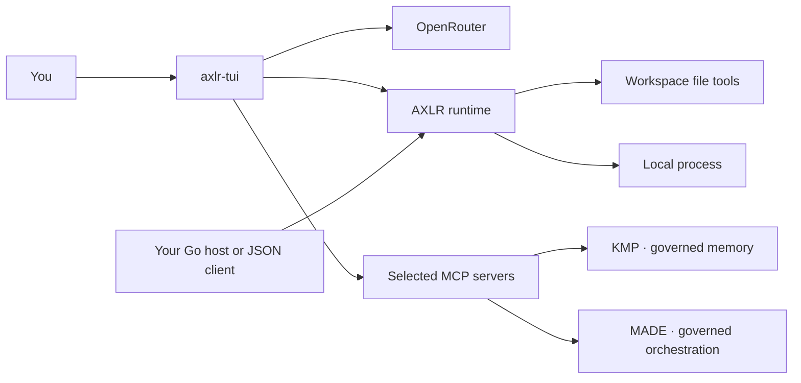

<p align="center"></p>

<p align="center"><strong>Run an agent in your workspace. Keep the execution boundary explicit.</strong></p>

AXLR is Underpass's agentic execution runtime. It owns the model loop and local execution. KMP governs durable, evidence-backed memory; MADE governs orchestration through ceremonies and human decisions. Both connect as separate MCP engines. The console streams OpenRouter responses, runs local tools and saves sessions; the Go library and JSON worker expose the execution core to other hosts.

AXLR runs in a **trusted local** Linux workspace. It is not a sandbox. File tools stay inside the selected root; an executed program and connected MCP servers still run with the authority you give them.

## Start the console

Build from a full checkout with Go 1.26:

```bash
GOWORK=off go test ./...
GOWORK=off go -C tui test ./...
go -C tui build -trimpath -o /tmp/axlr-tui ./cmd/axlr-tui
/tmp/axlr-tui --root "$PWD"
```

Supply `OPENROUTER_API_KEY` through your normal environment or secret manager before launching. In the console, choose a model with `/model` and send a prompt. Use `F1` for controls, `/mcp` for AXLR's server connections, and `/plugin` for AXLR-managed packages.

The console is a separate Go module in [`tui/`](tui/README.md). It can start with `--lang es` for Spanish labels and `--model provider/model` to skip the model picker.

## Choose a path

| You want to… | Read |
|:--|:--|
| Install, launch and send a first prompt | [Getting started](docs/getting-started.md) |
| Use models, controls, sessions and diagnostics | [Console guide](docs/console.md) |
| Connect KMP or MADE | [KMP runbook](docs/runbooks/kmp.md), [MADE runbook](docs/runbooks/made.md) |
| Choose a working ceremony or hand off a task | [Default ceremonies](docs/ceremonies.md) |
| Connect an MCP server or install a package | [Plugins and MCP](docs/plugins.md) |
| Call AXLR from a process through JSON | [Worker contract](docs/worker.md) |
| Review the planned HTTP API, Helm and release CI | [Service specification](docs/specs/axlr-service-api.md), [implementation plan](docs/plans/axlr-service-helm-release.md) |
| Embed AXLR in Go or use its MCP client | [Go library](docs/library.md) |
| Understand boundaries and package ownership | [Architecture](docs/architecture.md) |
| Resolve a startup, model, plugin or session problem | [Troubleshooting](docs/troubleshooting.md) |

[Documentation home](docs/index.md) includes the current guides and the historical design record.

## What runs where



In the console, the model can request a tool; AXLR shows or enforces the relevant approval policy before calling it. AXLR uses Codex-compatible plugin manifests and standard MCP connections: a Codex plugin built around skills and MCP servers will often work in AXLR without repackaging. `/plugin` installs the package into AXLR and registers declared servers with manual approval; `/mcp` shows the actual connections. A built-in KMP or MADE catalogue entry alone does not start either engine. See the [compatibility table](docs/plugins.md#codex-plugin-compatibility) for the supported components.

The JSON worker, `cmd/axlr`, accepts exactly one request on stdin and returns one response on stdout. It exposes `read`, `write`, `edit`, `exec`, `plugins.list` and `plugins.call`. The library exposes typed use cases and an OpenRouter client for non-streaming and streaming completions. See the [worker](docs/worker.md) and [library](docs/library.md) guides for examples.

## Project status

AXLR is an evolving pre-1.0 project. The repository has two Go modules and tests each independently. The current console is a trusted-local Linux application. The worker exposes a one-request process API; a network service API is being designed.

Part of [Underpass AI](https://underpassai.com).
