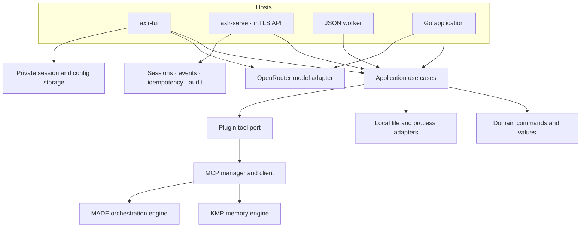

# Architecture and boundaries

AXLR is the execution entry point of the [product stack](product.md) and separates the execution core from its hosts. It grew from simplifying `underpass-runtime`'s execution layer, with Pi as a conceptual reference for a compact tool surface. AXLR owns the agent loop, local tools, session state and execution approvals. KMP owns durable, evidence-backed agent memory. MADE owns ceremony state, orchestration and human decision records. The engines are separate MCP servers; an installed catalogue entry is not an active connection. The root module has no terminal dependency. The `tui/` module contains shared agent/session use cases plus the console and HTTP service adapters. The JSON worker is another host adapter with a one-request lifecycle; a library host supplies its own loop.

| Package | Responsibility |
|:--|:--|
| `domain/` | Validated values, local commands and results, model messages and tool calls |
| `application/` | Ports and use cases; no terminal rendering |
| `adapters/local/` | Workspace file operations and local process execution |
| `dto/` | Strict JSON worker request and response contract |
| `runtime/` | Executor composition, codecs, request and response mapping, bounds |
| `plugins/` | Explicit MCP manifest and allowed-tool enforcement |
| `mcpclient/` | Named MCP stdio and Streamable HTTP sessions |
| `adapters/openrouter/` | Model request and response mapping, completion and SSE streaming |
| `cmd/axlr/` | One-request JSON process adapter |
| `tui/domain/`, `tui/application/` | Session/mode policy, bounded model context, turn loop, host controls and ceremony driver |
| `tui/adapters/terminal/`, `tui/cmd/axlr-tui/` | Console UI and composition, models, approvals, package browsing and engine preparation |
| `tui/adapters/ceremonyhost/`, `tui/adapters/madesetup/` | Pinned MADE procedures, actual check execution, KMP outcome calls and operator preparation |
| `tui/adapters/storage/`, `tui/adapters/diagnostics/` | Private sessions, settings, MCP config and diagnostics |
| `tui/service/`, `tui/cmd/axlr-serve/` | HTTP/mTLS adapter, principal roles, event journals, direct calls, idempotency and remote engines |

## Authority

The worker's `trusted-local` profile and the console run with the host account's permissions. `os.Root` anchors file operations inside the selected workspace. The `exec` program, its arguments and connected MCP servers can act with broader account authority; the console therefore shows local tool calls for review and persists explicit per-server MCP approval policies. The JSON worker and root library have no interactive approval layer; their host must enforce one if needed. Console work modes additionally restrict local operations. Saved approvals/full autonomy do not override a restricted mode or the first approval of a ceremony check command. External MCP calls retain their own policy and engine authorization.

No tool is registered through directory scanning. A manifest must name the MCP transport and its allowed tools. AXLR's package catalogue reads the Codex plugin format into AXLR's own storage and can register declared MCP servers. Skills and MCP declarations are the supported compatibility surface; other package files are retained but not activated. `/mcp` remains the source of truth for active connections. Model output does not grant a capability; the host's registry and policy decide what can run.

## Composition boundaries

The console wires package/skill discovery, six work modes, engine setup/update and the MADE ceremony driver. The driver invokes registered `made` and optional `kmp` tools directly through the execution port for its bookkeeping; those calls are not individual model approval dialogs. The user selects the driven procedure and approves its check command. Engine-side grants remain essential.

Self-repair adds a coordinator in `tui/application` (`SelfRepair`) that validates the agent's request against the session transcript, keeps the repair registry and drives a second session in the background. That session gets its own AXLR runtime rooted in the clone (a second `runtime.Executor`, tool runner, forge and ceremony driver, composed in `tui/cmd/axlr-tui`), while the model client, the session store and the MCP manager are shared. The console never changes its own executable; a merged repair is reported to the origin session with the build it still runs.

The HTTP binary reuses turn use cases but wires only the configured remote KMP/MADE adapters, manual tool policy and the model client. It does not wire package skills, mode selection or `CeremonyDriver`. HTTP session creation accepts a model, not a mode or plugin configuration. Readiness performs model-configuration and engine-discovery checks, not a paid model turn or authorization test for every engine operation.

The driver checks exact 2.0 definition digests before start. Its optional KMP integration uses `ws:<session-id>` and best-effort recall/outcome recording. Stable project recall and graph relations are explicit agent work. [Ceremonies](ceremonies.md) separates this driver from the embedded 1.0 skill catalogue.

## State and failure

The JSON worker closes after one response. A long-lived Go host can reuse an executor and MCP manager. The TUI stores private sessions and preferences locally, with one writer lock per open session. It restores interrupted work without executing pending calls until the person explicitly continues. Mode and ceremony data are stored in session sidecars; the model receives a bounded projection while the full transcript remains available. The HTTP service persists sessions, journals, direct calls, idempotency and audit under a dedicated state directory and requires one replica.

AXLR distinguishes validation rejection, operation failure, cancellation and timeout. A timed out or disconnected effectful call may already have acted. Neither the worker nor MCP client treats a missing response as proof of no effect. The service can mark interrupted direct effects `uncertain`; the operator reconciles against the external target. [Recovery](runbooks/recovery.md) covers these boundaries.

## Provenance and design record

AXLR is a focused rewrite of an execution layer in the earlier [Underpass runtime](provenance.md). Pi influenced the choice of a compact tool surface; AXLR does not use Pi code or runtime. Dated [plans](plans/), [specs](superpowers/specs/) and [diagnostics](diagnostics/) explain how the current shape was reached. Use the current guides for operational behavior.
