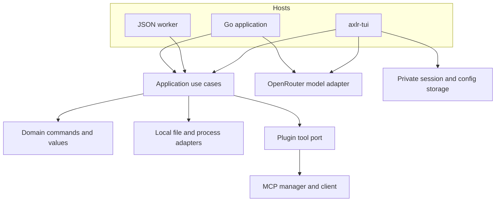

# Architecture and boundaries

AXLR separates local execution from the host that asks for it. The root module has no terminal dependency; the TUI is a separate host module. The JSON worker is another host adapter with a one-request lifecycle.

| Package | Responsibility |
|:--|:--|
| `domain/` | Validated values, local commands and results, model messages and tool calls |
| `application/` | Ports and use cases; no terminal rendering |
| `adapters/local/` | Workspace file operations and local process execution |
| `dto/` | Strict JSON worker request and response contract |
| `runtime/` | Executor composition, codecs, request and response mapping, bounds |
| `plugins/` | Explicit MCP manifest and allowed-tool enforcement |
| `mcpclient/` | Named MCP stdio and Streamable HTTP sessions |
| `adapters/openrouter/` | Model request and response mapping, completion and SSE streaming |
| `cmd/axlr/` | One-request JSON process adapter |
| `tui/` | Console UI, policy review, sessions, model catalogue, diagnostics and package browsing |

## Authority

The worker's `trusted-local` profile and the console run with the host account's permissions. `os.Root` anchors file operations inside the selected workspace. The `exec` program, its arguments and connected MCP servers can act with broader account authority; the console therefore shows local tool calls for review and persists explicit per-server MCP approval policies. The JSON worker has no interactive approval layer; its host must enforce one if needed.

No tool is registered through directory scanning. A manifest must name the MCP transport and its allowed tools. A Codex plugin package is a separate installation from an AXLR MCP connection. Model output does not grant a capability; the host's registry and policy decide what can run.

## State and failure

The JSON worker closes after one response. A long-lived Go host can reuse an executor and MCP manager. The TUI stores private sessions and preferences locally, with one writer lock per open session. It restores interrupted work without executing pending calls until the person explicitly continues.

AXLR distinguishes validation rejection, operation failure, cancellation and timeout. A timed out or disconnected effectful call may already have acted. Neither the worker nor MCP client treats a missing response as proof of no effect.

## Provenance and design record

AXLR is a focused rewrite of an execution layer in the earlier [Underpass runtime](provenance.md). Pi influenced the choice of a compact tool surface; AXLR does not use Pi code or runtime. Dated [plans](plans/), [specs](superpowers/specs/) and [diagnostics](diagnostics/) explain how the current shape was reached. Use the current guides for operational behavior.
