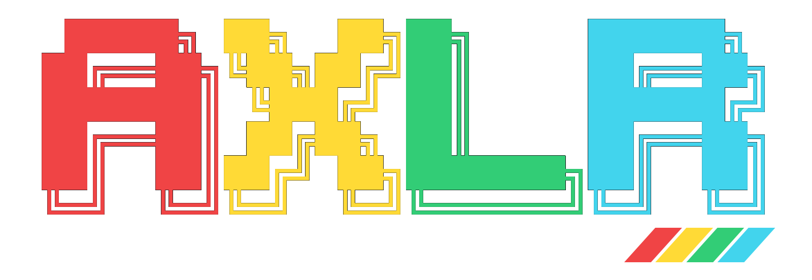

# AXLR identity

This is the AXLR wordmark supplied for the project. Its block letters, stepped outlines and saturated red, yellow, green and cyan form the shared visual language used in the documentation.

The repository keeps the supplied [PNG wordmark](assets/axlr-wordmark.png) at its original 1600 × 479 resolution. The [transparent AXLR export](assets/brand/axlr-spectrum.png) preserves those letters and adds the four Spectrum bars. The [brand asset pack](assets/brand/README.md) also contains matching transparent KMP and MADE logos in SVG and PNG. Preserve each asset's aspect ratio. For text-only contexts, write **AXLR**. The wordmark itself contains the complete lettering, so do not crop a letter as a substitute icon.

The asset is a raster image. If a scalable master becomes available later, export from that source and keep the proportions and colors of this supplied wordmark.
