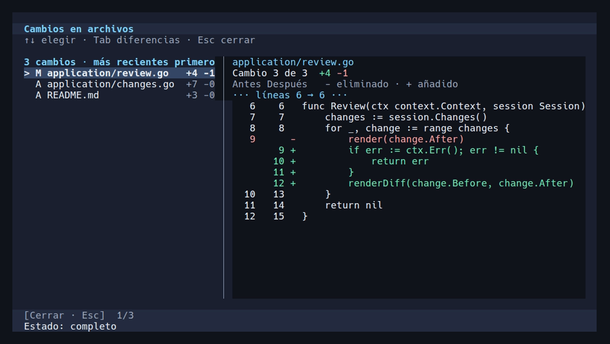

# Interactive console

`axlr-tui` is AXLR's terminal interface. It streams OpenRouter output, lets you review tool calls, and keeps resumable local sessions. [Getting started](getting-started.md) covers the initial build and launch.

## Work in a session

The console uses the current directory unless `--root` names another existing workspace. Type a prompt and press Enter. Use Shift+Enter for a newline. While AXLR is running, sending another message queues it: the transcript shows it as queued and the footer adds “message queued”. The current model step is not interrupted, so a reasoning model keeps its work; the queued message starts the next turn when that response ends, or replaces the next model request after a tool finishes. Several messages sent meanwhile are joined. Esc still cancels the running step. Up and Down in the composer browse only this session's user messages and return to the current draft. The first model choice is made through `/model` or `--model`; selecting a model in `/model` also saves it as the default for future new sessions.

The model picker filters to text models that support tools. Tab changes provider, arrows and PgUp/PgDn move, and Enter selects. A catalog failure offers Retry. A `--model` value bypasses the catalog for that launch. The selected model can change later only when the turn is idle, complete or interrupted without pending tool calls; the transcript remains in the session.

| Control | Action |
|:--|:--|
| `Enter` / `Shift+Enter` | Send / insert a newline |
| `/model` | Choose a model |
| `/normal`, `/review`, `/writer`, `/research` | Choose direct work and its local tool policy |
| `/debug`, `/delivery`, `/incident` | Select a console-driven MADE procedure for the next prompt; `/incident` also opens a pending approval card |
| `/update` | Update explicitly configured local KMP and MADE engines |
| `/mcp` | Inspect connected MCP servers, tools and approvals |
| `/approvals` | Show saved always-allow tools and autonomy mode |
| `/autonomy on` / `/autonomy off` | Automatically approve permitted known tools, or restore normal policy |
| `/plugin` | Browse packages installed in AXLR and available sources |
| `/theme` | Preview and save appearance |
| `/changes` / `/diff` / `Ctrl+D` | Review this session's file changes |
| `Ctrl+P` | Open the action palette |
| `Ctrl+O` | Open a saved session |
| `Ctrl+F` | Search the current conversation |
| `Ctrl+R` | Explicitly continue an interrupted turn |
| `Tab` | Switch between transcript and activity views |
| `F1` | Show in-app help |
| `Esc` | Close an overlay or cancel the active turn |
| `Ctrl+C` | Cancel active work; quit when idle |

The interface supports mouse controls where the terminal supplies them. In an approval dialog, inspect the exact target and arguments with arrows, PgUp/PgDn or the wheel; `A` approves once and `D` denies. When offered, `L` executes this call and always allows the exact tool identity on future calls, `F` activates full autonomy and executes this call. `/approvals` lists saved choices. The autonomy switch approves known tools that the work mode permits; it persists until turned off. Restricted modes still require a decision for every local `exec`, and a new ceremony check command always needs approval. Their dialogs offer only decisions that apply to that call. Unknown tool names cannot be approved. An ordinary turn is limited to 32 tool calls; driven ceremonies reset the allowance as a step advances. Cancellation does not reverse an effect that already happened.

## Work modes

Select a mode with its slash command between turns, after choosing a model. The mode is saved with the session and applies to subsequent work; switching while busy or with pending calls is refused. `normal` is the default for a new session.

| Command | Purpose | Local tool policy |
|:--|:--|:--|
| `/normal` | General agentic work | All four local tools, under saved approval policy |
| `/review` | Findings with locations, failure scenarios and evidence | Read; write/edit hidden and refused; every exec needs approval |
| `/writer` | Brief, outline, draft, critique and at most two revisions | Write/edit only `.md`, `.mdx`, `.txt`, `.rst` or paths under `docs/`; every exec needs approval |
| `/research` | Recover memory, read primary sources and produce a supported decision | Same document write policy as writer; every exec needs approval |
| `/debug` | Reproduce, diagnose, repair and integrate | All local tools; console drives MADE `axlr_debug` 2.0 |
| `/delivery` | Brief, build/check and integrate | All local tools; console drives MADE `axlr_delivery` 2.0 |
| `/incident` | Blameless postmortem with review and person's approval | All local tools; model KMP outcome writes refused; console drives MADE `axlr_incident` 1.0 |

`review`, `writer` and `research` refuse any local exec with nonempty `stdin`, including when full autonomy is enabled. Arguments remain visible for per-call review. These restrictions apply to AXLR's local tools: MCP calls retain their own approval policy and may have external side effects. An approved process is not sandboxed by the mode.

Direct modes do not start ceremonies. For debug/delivery/incident, [prepare MADE](runbooks/made.md#prepare-the-driven-ceremonies), select the mode, then send the task. AXLR starts and claims the pinned definition; the model performs the work and hands results to `axlr_step_done`. A new debug/delivery check command is approved once, then reused unchanged for repair/build verification. Incident drafts receive a fresh-context review, then the person's approval through the `/incident` card. On `COMPLETED` or `BLOCKED`, the session returns to normal mode. Missing MADE or definitions prevents this start; there is no silent substitute ceremony. [Ceremonies](ceremonies.md) describes the two execution paths and recovery limits.

The local process environment contains only a sanitized absolute `PATH` and the host's `HOME` when it is absolute, so tools find their usual configuration (`~/.gitconfig`, `~/.cargo`, caches). Other shell variables and provider credentials are not inherited by console exec/check commands. A check that works in your login shell may therefore need explicit paths or a workspace script with documented prerequisites.

## Review file changes

Open `/changes` (or `/diff`, `Ctrl+D`, or **File changes** in the action palette) to review completed local `write` and `edit` calls, newest first. A Changes button with a count appears after the first change. Each entry represents one recorded edit, so repeated edits to a file remain individually reviewable. The preview shows the exact before and after text, line numbers, three lines of context, and added/removed counts. It works without Git and survives reopening the session, even if the workspace file has since changed.



Use Up/Down to select an entry and Tab to focus its diff. PgUp/PgDn and the wheel scroll; Left/Right pan long lines; Home/End jump to the beginning/end; `[` and `]` select another entry while reading. Esc returns to the conversation and preserves the draft. At 90 columns or more the list and diff appear together; narrower terminals switch between them with Tab. File rows and Close also support the mouse.

Previews retain at most 64 KiB and fewer than 2,000 newlines per version. Larger files and unavailable text previews show an explicit notice, without a partial or guessed diff. Failed, denied, cancelled and unchanged edits do not appear. Empty file creation does. File snapshots are stored privately with tool activity, outside the messages sent to the model. Existing sessions without snapshots remain readable; old edits cannot be reconstructed. `exec` commands and MCP/plugin effects do not produce file snapshots.

## Appearance and language

`/theme` offers Auto, Ink, Aurora, Paper, Phosphor and Editorial. Editorial is light and also changes the layout: speaker labels, consecutive tool calls summarised in one line, and the approval as a bottom sheet. Press `I` for Safe, Nerd Mono or ASCII icons; `A` toggles reduced motion; Enter saves. Nerd Mono needs a Nerd Font configured in the terminal. `NO_COLOR=1` disables color.

The input's text, background, placeholder, selection and cursor follow the active theme, including live previews and cancellation. Auto also updates the input after detecting the terminal's background.

English is the default. `--lang es` or `AXLR_LANG=es` changes interface labels only. Prompts, tool results and stored conversation text are not translated.

## Edit settings as JSON

The console reads `$XDG_CONFIG_HOME/axlr/settings.json`, or `$HOME/.config/axlr/settings.json` when `XDG_CONFIG_HOME` is unset. Create or edit it with any text editor:

```json
{
  "model": "provider/model",
  "language": "es",
  "theme": "auto",
  "icons": "safe",
  "reduce_motion": false,
  "approvals": {
    "autonomous": false,
    "allowed": []
  }
}
```

All keys are optional. `model` may be empty to choose a model in the console. `language` accepts `en` or `es`; `theme` accepts `auto`, `ink`, `aurora`, `paper`, `phosphor` or `editorial`; `icons` accepts `safe`, `nerd-mono` or `ascii`. In `approvals`, `autonomous` enables automatic approval for every known tool; `allowed` contains exact tool identities saved by the approval dialog. Edits take effect on the next launch. `--model` overrides the JSON model for one launch; `--lang` overrides `AXLR_LANG`, which overrides the JSON language. Selecting `/model`, saving `/theme`, or changing `/autonomy` or always-allow choices updates the corresponding JSON keys while retaining other settings, including keys from newer AXLR versions. The console writes the file with owner-only permissions and rejects invalid JSON without replacing it.

Existing `model-preference.json` and `ui-preference.json` files under the state directory are read until `settings.json` exists. Existing `approvals.json` choices are read until `settings.json` has an `approvals` section. The next related change writes those values into `settings.json`; the old files are left in place. MCP server connections and their own approval policies remain in the separate `$XDG_CONFIG_HOME/axlr/mcp.json` file.

## Model context

The private session store retains the full transcript. Model requests receive a bounded projection: a 1 MiB message-history ceiling, a 768 KiB low watermark, normally at most 64 KiB per tool result, and a 16 KiB extractive checkpoint. These are byte limits, not the model's advertised token window. Host results such as exact tool-discovery schemas are retained up to 64 KiB, and `axlr_history` pages hold up to 32 KiB.

When the active turn alone exceeds the budget, AXLR progressively reduces its tool-result excerpts to 8, 4, 2 and then 1 KiB. It asks the model to finish from the evidence already gathered. The current prompt and tool arguments are not silently shortened; context that still cannot fit produces an explicit error. Full saved results remain intact. `axlr_history` can recover earlier-turn messages, but refuses tool results from the current turn to avoid a rereading loop.

The model normally sees four local tools plus `axlr_tools` (exact plugin schema discovery), `axlr_call_tool` (registered plugin invocation), `axlr_history` (paged saved messages), `axlr_skill` (paged skill resources) and `axlr_session` (current-session title and exact memory scope). Session bookkeeping fills missing fields without replacing manual titles and runs without a separate approval; plugin calls retain their configured policy. Review mode hides local write/edit; an active driven ceremony adds `axlr_step_done`. Plugin arguments are validated against the discovered schema before execution; `x-*` keywords are treated as annotations. `axlr_tools` returns a schema without its `x-*` annotations; a schema that still does not fit one host result comes back as an outline of paths and sizes, and `path` (a JSON pointer such as `/properties/stages`) returns that part exactly, including an annotation such as `/x-made-pattern-catalog`. Read only the required schema and follow resource page cursors. [Context policy research](research/2026-09-30-context-policy.md) records the original design; [the audit](documentation-audit.md) covers the later active-turn compaction change.

## Saved sessions and recovery

Sessions live under `$XDG_STATE_HOME/axlr/sessions` or `$HOME/.local/state/axlr/sessions`. User settings live in the [editable JSON file](#edit-settings-as-json). Directories use owner-only permissions; snapshots and settings written by AXLR are private files. An open session has an exclusive writer lock.

Open a session with `Ctrl+O` or start with:

```bash
/tmp/axlr-tui --root "$PWD" --session 0123456789abcdef0123456789abcdef
```

The workspace must match the saved one. The saved model is restored without a catalog request; an accompanying `--model` must match it. An interrupted session loads without executing pending calls. Use `Ctrl+R` to continue explicitly; pending tools follow the current approval policy. Partial output remains an interrupted draft outside valid model history.

## Diagnostics and privacy

Each launch writes a private JSONL timing trace under `$XDG_STATE_HOME/axlr/logs`, falling back to `$HOME/.local/state/axlr/logs`. The path is printed at startup. Trace records cover startup, requests, streaming, tools, rendering and session saves; they omit prompts, responses, tool arguments, model IDs and credentials.

By default, a separate private directory beside the trace captures OpenRouter HTTP request and response bodies, including model catalog and errors. Those bodies can contain prompts and tool results. Authorization headers are excluded; configured API keys and recognizable credential patterns are redacted. Capture is bounded to 8 MiB per file, and a launch can create multiple files. Use `--trace-payloads=false` to disable body capture while retaining timing records. `--trace-file /path/trace.jsonl` selects another trace path and appends to an existing file.

The [payload audit](diagnostics/2026-09-30-tui-payloads.md) and [MCP diagnostic](diagnostics/2026-09-30-tui-mcp.md) contain measured examples. [Troubleshooting](troubleshooting.md) gives a symptom-first path.
